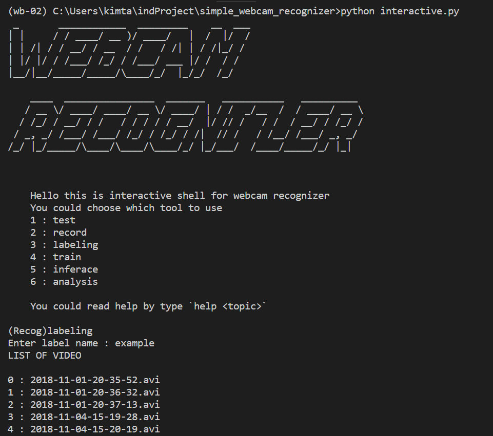

# Smiple Webcam Recognizer

[TOC]

## Pre-requirement

```shell
pip install opencv-python
pip install fire
pip install tensorflow=1.5
pip install keras
pip install pillow
pip install pyfiglet
```

Or you could easily build environment using `conda` with `env.yml` file

```노
conda env create -f env.yml
```

After that, activate environment using `activate wb-02`

## Caution

It is only tested on window10

## How to use

### Interactive mode

You could easily use by interactive shell

just `python interactive.py`



### file call

You could call exact function you want by python file

**BUT READ detailed document in python file to USE**

So I recommend to use Interactive mode.

## Function explain

Detail explain is in python file. This is simple explain

### 1. Video Recording

#### parameter

##### Optional

- --path: The path where save the video

#### How to stop

Press 'q'

#### How to pause

press 's'


### 2. Labeling the video frame

#### parameter

- --label : The label name
  - It will make a new folder with that name, and save the all the frame image  
- --videoname  :  The name of video

#### How to use

There exist 2 mode seperately

- 'playmode' : Automatically play the video. If not, you could pass frame by press any key except reserved key.

- 'capturemode' : Save frame that shown in monitor. So this should be turn on when object you what to train is on frame.

You could watch which mode you are at video left top.

The default mode is not playmode, not capturemode.

- RESERVED KEY:

​            'q' : stop labeling

​            's' : change playmode

​            'c' : change capturemode

​            ':{number}f' : You could pass the frame you want.

​                For example, if you press ':500f', then it will pass 500 frames.


### 3. Train model

Make CNN model with your dataset

**It is recommended to use pretrained model**

#### Parameter

##### Optional

- --pretrained : y|n
  - The pretrained model is MobileNetv2
- --path : Dataset path
- --BN : True|False
  - Wheter use batch normalization
- --epoch : Number of epoch

### 4. Inference

Inference real time video from webcam

#### Parameter

- --model : Name of model to use

##### Optional

- --path : path for save result

### 5. Analysis

- shap
- Not supported now

## TODO

[] The training parameter record, tensorboard

[] Object Detection

[] Inference result save

[] Analysis

[] Test on other os